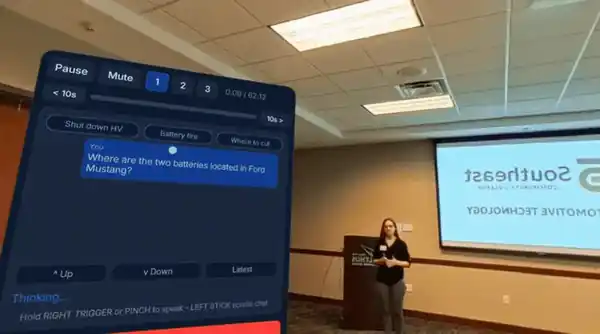
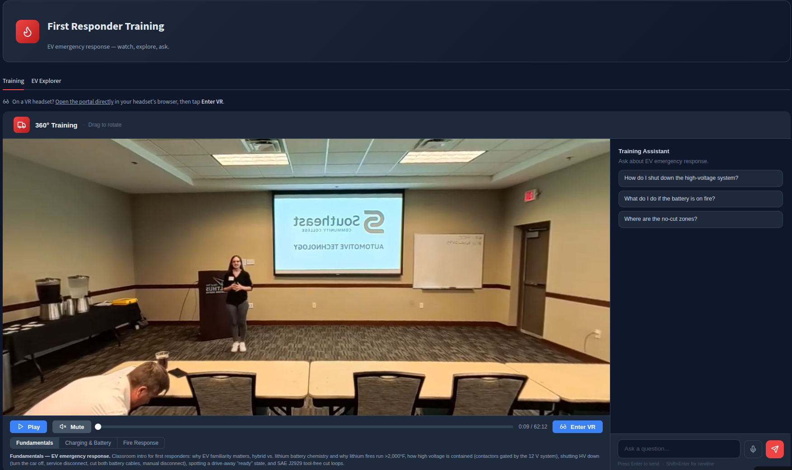
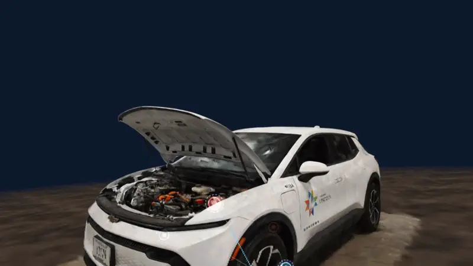

# First Responder training Portal

**Grounded AI + VR training for electric-vehicle emergencies.**

- 🎥 **360° training videos**, in the browser or on a Meta Quest
- 💬 **AI assistant** that answers from official manufacturer guides, with citations
- 🚗 **VR vehicle scans** with clickable hazard hotspots


<p align="center">
  
  <br><em>On a Meta Quest 3: answers cite the guide page and video timestamp.</em>
</p>

| Desktop portal | Gaussian Splat of the EV in VR |
|---|---|
|  |  |
| 360° lecture video + AI assistant | Critical zones labeled with emergency response steps from official guides |

---

## Why

- EVs bring new hazards: live high-voltage cables, airbags that stay armed, battery fires that are hard to put out.
- The answers are in **Emergency Response Guides (ERGs)**: long PDFs, different for every model.
- **A wrong answer is worse than no answer.**

| Design choice | What it prevents |
|---|---|
| Separate index per vehicle | Mixing up two cars' procedures |
| Asks "which vehicle?" when unsure | Guessing a model-specific step |
| Cites the page or timestamp | Unverifiable answers |
| Hazard markers flagged until verified | Presenting a guess as fact |

---

## Results

**1. Grounding and abstention:** [details](docs/EV_responder_QA_comparison.md)

| Question | Result |
|---|---|
| No vehicle named (16) | 16/16 asked "which vehicle?", 0 invented steps |
| Same 16, vehicle named | 14 cited answers + 2 correct "not in the guide" |
| New vehicle-specific (5) | 5/5 cited answers |

**2. Transcript Q&A:** [details](ops/eval/results/2026-09-25-llm-graded.md)

19 real questions from the training class, graded by an LLM judge:

| Correct | Partial | Incorrect | Cited a source |
|---:|---:|---:|---:|
| **79%** (15) | 11% (2) | 11% (2) | **100%** |

**3. Retrieval depth**
- With top-k = 4, answers mixed facts between vehicles.
- With top-k = 10, the mixing stopped. `ops/n8n_sync.py --check` enforces the setting.

---

## How it works

```
 Browser / Meta Quest  ──question──►  n8n AI agent  ──►  Pinecone
 (360° video, chat, VR)               (picks source)     ├─ 13 vehicle guides
          ▲                                              └─ video transcripts
          └────────────── cited answer ──────────────────┘
```

| Part | Built with |
|---|---|
| 360° portal + in-VR chat | Meta Immersive Web SDK (WebXR), TypeScript |
| VR vehicle scans | Gaussian splats, three.js + Spark |
| AI agent | n8n, LLM router, per-session memory |
| Search | Pinecone, OpenAI embeddings, top-k = 10 |
| Documents | 23 ERG / Rescue Sheet PDFs, 13 EV models |
| Voice | Browser speech API; Whisper fallback on Quest |

---

## Run it locally

No API keys needed; the chatbot uses the hosted AI.

```bash
# needs Node.js 20+
git clone https://github.com/Irfan-Gazi0/EV-Responder-AI-VR.git
cd EV-Responder-AI-VR/apps/portal
npm install
npm run dev        # opens https://localhost:8081
```

- "Not Secure" warning → *Advanced → Proceed* (normal for local testing)
- Try asking:
  - *Where are the no-cut zones on a Tesla Model S?*
  - *How do I disable the high-voltage battery?* (it will ask which vehicle)
- No headset? **Enter VR** opens a built-in Quest emulator.

---

## Folders

| Folder | Contents |
|---|---|
| `apps/portal/` | 360° portal (start here) |
| `apps/splat-vr/` | VR vehicle-scan viewer |
| `apps/v1/` | Older version (fallback) |
| `ingestion/` | Load PDFs + transcripts into Pinecone |
| `ops/` | Eval harness + workflow checks |
| `deploy/` | Publish to AWS |
| `docs/` | Eval write-ups, media |

---

## Troubleshooting

| Problem | Fix |
|---|---|
| `npm install` fails | Use Node 20+ (`node --version`) |
| Page is blank | Wait a few seconds, then refresh |
| Chatbot doesn't reply | Hosted AI may be offline; try later |
| Port 8081 in use | Stop the other `npm run dev` |

---

**Author:** Irfan Gazi · [GitHub](https://github.com/Irfan-Gazi0) · **License:** Apache-2.0
